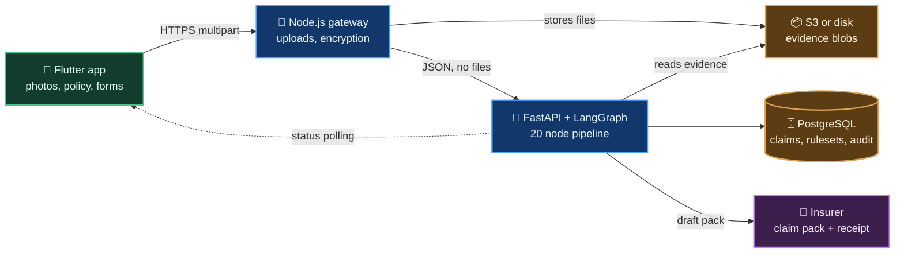
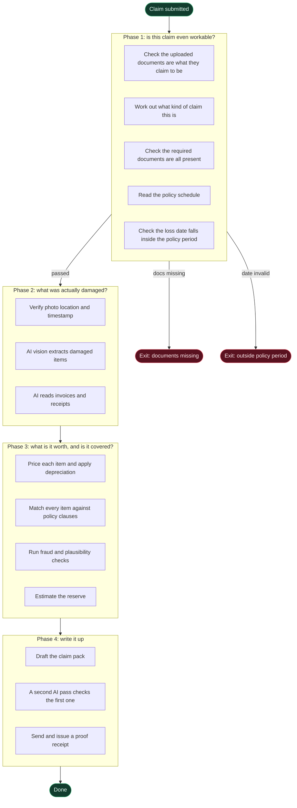

# SurakshaDraft

**An AI claims assistant that turns photos of damaged property into a complete, checked insurance claim pack.**

---

## The problem

When natural disasters like floods hit certain parts of India, it results in a lot of damages to MSMEs (Micro Small & Medium Enterprises).
In order to get compensation, the owners file claim forms to their respective insurance companies. However, due to various reasons such as
inadequate timelines they lose out an actually getting the insurance for their lost product. 

This is where SurakshaDraft comes in. Our product acts as a catalyst in this entire pipeline. By speeding up the entire process, it gives claimants a far better chance at actually getting compensation by the end of it. 

This however, is just one part of the picture. We also significantly reduce the workload of the insurance company by providing them with a 
final list of approved and rejected claims along with their respective reasons. We DO NOT make the final decision for the insurer but we 
certainly help them make a far more informed decision and provide them with all the information they need.

## What we built

A claimant opens the app at the damaged site and takes photos. From that point on:

1. **AI reads the photos** and proposes a list of damaged items with quantities and categories.
2. **The claimant confirms or edits** that list. They are never asked to write it from scratch.
3. **The pipeline checks the policy**, prices each item with depreciation, and flags anything the policy excludes.
4. **The claimant gets an instant checklist** of the exact documents still needed, called a Letter of Requirement.
5. **A draft claim pack is generated**, quality checked by a second AI pass, and sent to the insurer with a tamper evident receipt.

What used to take weeks of back and forth becomes a guided session on a phone.

### The idea that makes it trustworthy

An insurance claim is a financial and legal document. You cannot let a language model decide whether someone gets paid.

So we split the work. **The model observes. Python decides.**

The model reads a photo and says "this looks like a damaged laptop." The model reads a policy PDF and says "this clause mentions electronics." But every decision that can reject a claim, block it for missing documents, or cap a payout is made by ordinary, testable Python code with fixed rules. The model never picks the verdict.

That is why this can be pointed at real money.

---

## How it works



Four pieces:

* **Flutter app.** Runs on Android. Captures geotagged, timestamped photos. Works offline and saves drafts locally until the phone has signal again.
* **Node.js gateway.** Takes file uploads, deduplicates them by content hash, encrypts identity documents, and hands clean JSON to the pipeline. It never runs AI itself.
* **Python pipeline.** A FastAPI service wrapping a LangGraph state machine of 20 steps. This is where all the thinking happens.
* **PostgreSQL and blob storage.** Claims, policies, insurer rulesets and a full audit trail of every AI call.

### Inside the pipeline

The claim moves through four phases. If it fails a gate, it exits early and tells the claimant exactly why.



The document check sits **first**, on purpose. A claim that can never be completed costs two AI calls instead of a dozen.

---

## Using the platform

### As a claimant

1. Open the app and unlock with your fingerprint.
2. Pick your language and whether you are a personal or commercial customer.
3. Sign in, then upload your policy document once. The app reads your cover limits from it.
4. When something is damaged, tap to start a claim and photograph each item.
5. Confirm the item list the AI proposes. Fix anything it got wrong.
6. Read your checklist. It tells you exactly which documents are still missing.
7. Upload those documents and submit. Watch the status update live.

### As an insurance firm

Sign in with a firm account and you land on a dashboard showing every claim filed against you, with its status, item list and generated pack.

---

## Directory structure

```
surakshadraft/
├── agentic_pipeline/        The AI brain (Python)
│   ├── graph.py             The 20 node LangGraph state machine
│   ├── service.py           FastAPI endpoints
│   ├── prompts.py           Every AI prompt, in one file
│   ├── schemas.py           The shapes the AI must return
│   ├── requirements.py      Letter of Requirement engine
│   ├── models.py            Database tables
│   ├── repository.py        Database reads and writes
│   ├── migrations/          Schema history
│   ├── rulesets/            Insurer requirement lists as JSON
│   └── tests/               19 test files
├── backend/                 The gateway (Node.js)
│   └── server.js            Uploads, encryption, request forwarding
├── mobile_app/              The Flutter app
│   └── lib/
│       ├── screens/         One file per screen
│       ├── models/          Data shapes
│       └── services/        Offline drafts, identity
├── scripts/                 Server setup and maintenance
├── docs/                    Documentation (start with overview.md)
├── docker-compose.yml       Local development
└── docker-compose.prod.yml  Production stack
```

---

## Running it locally

You need Docker, Python 3.11 and Flutter.

```bash
# 1. Start Postgres and Redis
docker compose up -d db redis

# 2. Set up the database
cd agentic_pipeline
pip install -r requirements.txt
cd .. && alembic upgrade head

# 3. Load a default insurer ruleset
python -m agentic_pipeline.rulesets_cli import-json agentic_pipeline/rulesets/default.json
python -m agentic_pipeline.rulesets_cli activate default 2026-08-09

# 4. Start the AI pipeline
uvicorn agentic_pipeline.service:app --port 8000

# 5. Start the gateway (new terminal)
cd backend && npm install && npm start

# 6. Run the app (new terminal)
cd mobile_app && flutter run
```

Copy `.env.prod.example` to `.env` and fill in your AI provider key first. The pipeline supports Google Gemini and IBM watsonx, switchable with one setting.

---

## Tech stack

| Layer | Choice |
|---|---|
| Mobile | Flutter, Firebase Auth, biometric unlock |
| Gateway | Node.js, Express, Multer, AES 256 GCM encryption |
| AI pipeline | Python, FastAPI, LangGraph, LangChain |
| Models | Google Gemini or IBM watsonx |
| Data | PostgreSQL 16, Redis, S3 or local disk |
| Deployment | Docker Compose, nginx, single EC2 instance |

---

## Documentation

| Document | What it covers |
|---|---|
| [docs/overview.md](docs/overview.md) | How every piece connects, end to end |
| [docs/agentic_pipeline.md](docs/agentic_pipeline.md) | Every node, gate and rule in the AI pipeline |
| [docs/mobile_app.md](docs/mobile_app.md) | Screens, offline drafts, app flow |
| [docs/deployment.md](docs/deployment.md) | Running it on a real server |
