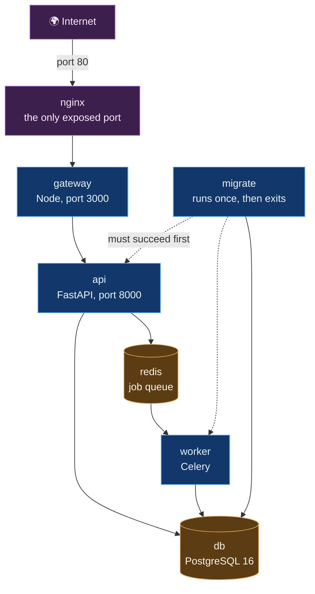

# Deployment

Two ways to run this: on your own machine for development, or on one small cloud server for a real demo. Both use Docker.

---

## 1. Local development

You need Docker, Python 3.11, Node.js and Flutter.

```bash
# 1. Start Postgres and Redis
docker compose up -d db redis

# 2. Install Python dependencies
cd agentic_pipeline
pip install -r requirements.txt
cd ..

# 3. Build the database schema
alembic upgrade head

# 4. Load an insurer ruleset
python -m agentic_pipeline.rulesets_cli import-json agentic_pipeline/rulesets/default.json
python -m agentic_pipeline.rulesets_cli activate default 2026-08-09

# 5. Start the AI pipeline
uvicorn agentic_pipeline.service:app --reload --port 8000

# 6. Start the gateway, in a second terminal
cd backend && npm install && npm start

# 7. Start the app, in a third terminal
cd mobile_app && flutter run
```

Create a `.env` at the repository root first. Copy `.env.prod.example` and fill in at minimum an AI provider key.

Check it is alive:

```bash
curl localhost:8000/          # the pipeline
curl localhost:3000/          # the gateway
```

---

## 2. What runs in production

Six containers on one machine.



Three things about this shape are deliberate:

**Only nginx publishes a port.** Postgres, Redis and the Python service have no host port mapping at all. They are reachable only on the internal Docker network. An exposed Postgres on a public IP gets found by scanners within minutes.

**Everything goes to the gateway.** nginx forwards all traffic to the gateway, which owns `/api/*`. FastAPI owns the separate `/api/v1/*` and is never reachable from the internet. The gateway is what hashes, encrypts and stores uploads before anything else sees them.

**migrate must exit cleanly before api or worker start.** A bad migration stops the deploy instead of starting the app against a half built schema.

### Memory ceilings

Every service has a `mem_limit`, sized for a 1 GiB host:

| Service | Limit |
|---|---|
| api | 420m |
| worker | 420m |
| migrate | 320m |
| db | 256m |
| gateway | 192m |
| redis | 96m |
| nginx | 64m |

Without ceilings, one runaway container makes the host OOM killer shoot a different one, usually Postgres. Raise them through `.env.prod` (`MEM_API`, `MEM_WORKER` and so on) rather than editing the compose file. These are floors, not targets.

Two related choices: Celery beat runs embedded in the worker with `--beat` instead of a seventh container, which saves a 150 MB LangChain import, and is only safe because there is exactly one worker. Both uvicorn and Celery run single process.

---

## 3. Deploying to AWS

Roughly an hour, most of it waiting on the first image build. Cost is about 13 to 14 dollars a month running continuously, which is EC2 plus a public IPv4 address plus a small EBS volume. No RDS, no load balancer, no NAT gateway, because those are the expensive parts.

### Before anything else, set a budget alarm

Billing and Cost Management, then Budgets, then a monthly cost budget of 15 dollars with alerts at 50, 80 and 100 percent. Choose to **include credits** rather than net them out, because a credit netted budget reads zero right up until the credits run out.

### Create the S3 bucket

```bash
export AWS_REGION=ap-south-1
export BUCKET=suraksha-blobs-$(aws sts get-caller-identity --query Account --output text)

aws s3api create-bucket --bucket "$BUCKET" --region "$AWS_REGION" \
  --create-bucket-configuration LocationConstraint="$AWS_REGION"

aws s3api put-public-access-block --bucket "$BUCKET" \
  --public-access-block-configuration \
  "BlockPublicAcls=true,IgnorePublicAcls=true,BlockPublicPolicy=true,RestrictPublicBuckets=true"

aws s3api put-bucket-encryption --bucket "$BUCKET" \
  --server-side-encryption-configuration \
  '{"Rules":[{"ApplyServerSideEncryptionByDefault":{"SSEAlgorithm":"AES256"}}]}'
```

### Give the instance a role, not access keys

```bash
cat > trust.json <<'JSON'
{"Version":"2012-10-17","Statement":[{"Effect":"Allow",
 "Principal":{"Service":"ec2.amazonaws.com"},"Action":"sts:AssumeRole"}]}
JSON

aws iam create-role --role-name suraksha-ec2 \
  --assume-role-policy-document file://trust.json

cat > s3policy.json <<JSON
{"Version":"2012-10-17","Statement":[
 {"Effect":"Allow","Action":["s3:GetObject","s3:PutObject","s3:DeleteObject"],
  "Resource":"arn:aws:s3:::${BUCKET}/*"},
 {"Effect":"Allow","Action":["s3:ListBucket"],
  "Resource":"arn:aws:s3:::${BUCKET}"}]}
JSON

aws iam put-role-policy --role-name suraksha-ec2 \
  --policy-name suraksha-s3 --policy-document file://s3policy.json

aws iam attach-role-policy --role-name suraksha-ec2 \
  --policy-arn arn:aws:iam::aws:policy/AmazonSSMManagedInstanceCore

aws iam create-instance-profile --instance-profile-name suraksha-ec2
aws iam add-role-to-instance-profile \
  --instance-profile-name suraksha-ec2 --role-name suraksha-ec2
```

This is why `S3_ACCESS_KEY` and `S3_SECRET_KEY` stay empty later. Both SDKs fall through to the instance role, so no long lived credentials are ever written to disk. The SSM policy gives you a shell without opening SSH.

### Open port 80 and nothing else

```bash
VPC=$(aws ec2 describe-vpcs --filters Name=isDefault,Values=true \
      --query 'Vpcs[0].VpcId' --output text)

SG=$(aws ec2 create-security-group --group-name suraksha-web \
     --description "SurakshaDraft public edge" --vpc-id "$VPC" \
     --query GroupId --output text)

aws ec2 authorize-security-group-ingress --group-id "$SG" \
  --protocol tcp --port 80 --cidr 0.0.0.0/0
```

### Launch it

```bash
AMI=$(aws ssm get-parameter \
  --name /aws/service/ami-amazon-linux-latest/al2023-ami-kernel-default-x86_64 \
  --query 'Parameter.Value' --output text)

aws ec2 run-instances \
  --image-id "$AMI" \
  --instance-type t3.small \
  --security-group-ids "$SG" \
  --iam-instance-profile Name=suraksha-ec2 \
  --block-device-mappings '[{"DeviceName":"/dev/xvda","Ebs":{"VolumeSize":20,"VolumeType":"gp3","DeleteOnTermination":true}}]' \
  --metadata-options '{"HttpTokens":"required"}' \
  --tag-specifications 'ResourceType=instance,Tags=[{Key=Name,Value=suraksha}]' \
  --query 'Instances[0].InstanceId' --output text
```

`DeleteOnTermination` stops an orphaned volume billing forever. `HttpTokens=required` turns on IMDSv2, which closes the path from a server side request forgery to stolen credentials. That is worth having on a machine whose job is fetching images supplied by users.

Get a shell with `aws ssm start-session --target "$IID"`, then `sudo su - ec2-user`.

### Prepare the machine

```bash
sudo dnf install -y git
git clone <YOUR_REPO_URL> suraksha
cd suraksha
sudo bash scripts/ec2_bootstrap.sh
```

That script adds 4 GB of swap, installs Docker and the Compose plugin, and caps container log sizes. **The swap is not optional.** Installing the LangChain and LangGraph dependency tree peaks above 1 GiB, and the build is otherwise killed by the OOM reaper with a bare `Killed`.

Log out and back in so the `docker` group applies, then check with `docker ps && free -h`.

On Ubuntu instead of Amazon Linux, use `scripts/ubuntu_bootstrap.sh`.

### Configure

```bash
mkdir -p secrets
cp .env.prod.example .env.prod

echo "POSTGRES_PASSWORD=$(openssl rand -hex 24)"
echo "PII_MASTER_KEY=$(openssl rand -hex 32)"

nano .env.prod
```

Five settings must be right:

**`POSTGRES_PASSWORD`** and the same password spelled out again inside `DATABASE_URL`. That file does not interpolate `${...}` into itself.

**`S3_BUCKET`**, set to the bucket you created. Leave `S3_ENDPOINT_URL`, `S3_ACCESS_KEY` and `S3_SECRET_KEY` empty so the instance role is used.

**`PII_MASTER_KEY`**. Back this up somewhere off the instance before going live. Lose it and every stored blob is permanently undecryptable.

**`LLM_PROVIDER`** and its keys. `gemini` needs `GOOGLE_API_KEY`. `watsonx` needs `WATSONX_API_KEY` and `WATSONX_APIKEY` (the same value read by two different libraries) plus `WATSONX_PROJECT_ID`. An empty key is not a fallback. Every AI call simply fails.

**`AUTH_MODE`**, and read this one carefully. The config default is `firebase`, but the app currently sends the Firebase `uid` rather than a signed ID token. So `firebase` mode rejects every token and fails open, which looks secure but behaves exactly like `disabled`: claims land anonymous and `GET /api/claims` returns an empty list.

| Mode | Use when |
|---|---|
| `disabled` | Default choice. Claims are anonymous |
| `demo` | You want claim history to work with the app as it stands. The bearer token *is* the user id, so short private demos only, never real claimant data |
| `firebase` | You have changed `subjectToken()` in `mobile_app/lib/services/identity.dart` to return `await user.getIdToken()` and placed a service account JSON at `secrets/firebase.json` |

### Deploy

```bash
docker compose -f docker-compose.prod.yml --env-file .env.prod up -d --build
```

First build takes 8 to 15 minutes on a `t3.small`. Almost all of that is the pip layer, and it is cached for every redeploy after.

### Verify

```bash
C="docker compose -f docker-compose.prod.yml --env-file .env.prod"
$C ps                          # 6 services, migrate showing Exited 0
curl -s localhost/healthz      # ok
curl -s localhost/api/requirements/default | head -c 300
```

That last one is the real end to end read. It goes nginx to gateway to api to the ruleset loader. If it returns JSON, the whole proxy chain and the FastAPI service are healthy.

Then from your own browser, `http://<PUBLIC_IP>/healthz`.

### Point the app at it

```bash
flutter build apk --release --dart-define=API_BASE=http://<PUBLIC_IP>
```

No port suffix, because nginx listens on 80. The Android manifest already sets `usesCleartextTraffic`, so plain HTTP works. The public IP changes on every stop and start, so for a short run just do not stop it.

---

## 4. Operating it

```bash
C="docker compose -f docker-compose.prod.yml --env-file .env.prod"

$C ps                    # what is running
$C logs -f worker        # watch a claim being processed
$C logs api              # pipeline errors
$C restart api           # restart one service
$C exec -T db pg_dump -U suraksha suraksha | gzip > backup.sql.gz
```

### When something is wrong

**`api` restart loops.** Almost always a malformed `DATABASE_URL`. Give it the full 90 second healthcheck grace period first, because the LangChain import graph takes 20 to 40 seconds to load on a burstable vCPU.

**Uploads fail with 413.** nginx caps bodies at 25 MB. Raise `client_max_body_size` in `nginx.prod.conf`.

**Claims time out mid submit.** Vision preview and claim submit both block on an AI round trip. The proxy timeouts are already raised to 300 seconds in `nginx.prod.conf`.

**The build gets `Killed`.** No swap. Run the bootstrap script.

**Claim history is empty.** `AUTH_MODE` is `firebase` while the app sends a uid. See the table above.

---

## 5. Tearing it down

Do this the moment you are finished. A forgotten instance is about 54 cents a day and an orphaned volume about 6 cents a day. Individually invisible, billing indefinitely.

Save anything you want first:

```bash
$C exec -T db pg_dump -U suraksha suraksha | gzip > /tmp/suraksha-final.sql.gz
aws s3 cp /tmp/suraksha-final.sql.gz "s3://$BUCKET/backups/"
```

Pull that down before emptying the bucket. Also save `.env.prod` off the machine if you might redeploy, because a regenerated `PII_MASTER_KEY` orphans every existing blob.

Then delete in this order: instance, then S3 bucket, then IAM role, then security group. The security group will not delete until the instance is gone.

Finish with an all regions sweep for stray instances. The console shows one region at a time, and a forgotten instance somewhere else is the classic way this goes wrong.

---

## 6. Known limits

This is a demo deployment, not a hardened production one.

* **Plain HTTP.** No TLS certificate. Traffic including claim photos is unencrypted in transit. Real use needs a domain and a certificate.
* **One instance.** No redundancy. The machine dies, the service is down.
* **One worker, concurrency 1.** One claim processes at a time. Fine for a demo, not for load.
* **Backups are manual.** Nothing is scheduled. `pg_dump` when you care.
* **The public IP moves** on every stop and start, and the app has the address compiled in, so a restart means rebuilding the APK.
