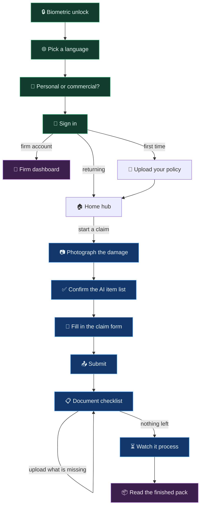

# The mobile app

A Flutter app for Android. This is the only thing a claimant ever touches, so it has to work at a damaged site, on a bad connection, in the user's own language.

Source: `mobile_app/lib/`.

---

## 1. The journey



The important loop is the one in the middle. The checklist tells the claimant exactly what is missing, they upload it, the list shrinks. They are never left guessing.

---

## 2. The screens

Each file in `lib/screens/` is one screen.

| Screen | File | Job |
|---|---|---|
| Biometric unlock | `main.dart` | Fingerprint or face before anything opens |
| Language select | `main.dart` | Sets the app language |
| Category select | `main.dart` | Personal or commercial |
| Sign in | `main.dart` | Google sign in via Firebase |
| Policy onboarding | `policy_onboarding_screen.dart` | One time setup, reads cover limits from the policy |
| Upload policy | `upload_policy_screen.dart` | Attach the policy schedule |
| Home hub | `item_list_screen.dart` | Every claim and draft, and where new claims start |
| Camera | `camera_screen.dart` | Capture with GPS and timestamp attached |
| Preview and confirm | `preview_confirm_screen.dart` | Review what the AI found in the photo |
| Claim form | `claim_form_screen.dart` | Event details and remaining documents |
| Checklist | `lor_checklist_screen.dart` | The Letter of Requirement, and uploads against it |
| Firm dashboard | `firm_dashboard_screen.dart` | Insurer side view of incoming claims |

`item_list_screen.dart` is the biggest file and the real centre of the app. It loads the dashboard, resumes and deletes drafts, fetches claims from the server, polls for status changes, opens the checklist and renders the finished pack.

---

## 3. Three things worth understanding

### Confirm, do not compose

After a photo is captured, `preview_confirm_screen.dart` calls the vision preview endpoint with that single image. Within seconds it shows what the AI thinks was damaged, and the claimant edits quantity, serial number and category on screen.

Those confirmed items travel with the submission. The gateway marks that evidence as already processed, so the pipeline uses the human confirmed list instead of running vision again.

If the preview call fails, or the user skips it, nothing breaks. The claim submits without confirmed items and the pipeline runs vision itself. The fast path is an improvement, never a dependency.

### Offline drafts

Damage often happens where signal does not reach. `services/draft_store.dart` handles it:

* Photos are copied into the app's own documents directory, so they survive the app being killed.
* Claim metadata goes into SharedPreferences.
* The draft shows on the home hub with everything captured so far.
* Back online, the claimant resumes it in the claim form and submits normally.

The evidence keeps its original capture timestamp and GPS position, not the time it was eventually uploaded. That matters, because the pipeline checks both against the loss window and the geofence.

### Stable identity

`services/identity.dart` makes sure the same person keeps the same server side identity:

* Signed in with Google, the subject is the Firebase `uid`, which survives a reinstall.
* Otherwise a random device id is generated once and kept in SharedPreferences.

It also issues **idempotency keys**. One key per submit attempt, reused across retries of that attempt. A submit that times out but actually succeeded on the server does not create a second claim.

---

## 4. Talking to the server

Everything goes through the Node gateway. The app never calls the Python pipeline directly.

The base URL is compiled in at build time:

```dart
const String kApiBase = String.fromEnvironment(
  'API_BASE',
  defaultValue: 'http://10.0.2.2:3000',
);
```

`10.0.2.2` is how the Android emulator reaches the host machine. Override it for a real device or a real server:

```bash
flutter run --dart-define=API_BASE=http://192.168.1.5:3000
flutter build apk --release --dart-define=API_BASE=http://13.233.105.68
```

Because it is compiled in, **a new server address means a new build**.

| App action | Endpoint |
|---|---|
| Preview a photo | `POST /api/preview` |
| Submit a claim | `POST /api/commercial/submit` or `/api/personal/submit` |
| Upload a checklist document | `POST /api/claim/:id/documents` |
| Correct the claim type | `POST /api/claim/:id/claim-type` |
| Poll one claim | `GET /api/claim/:id` |
| List my claims | `GET /api/claims` |
| Get the checklist | `GET /api/claim/:id/lor` |
| Firm dashboard | `GET /api/firm/:firm_name/claims` |

Every request carries `Authorization: Bearer <subject>`. Submits also carry `Idempotency-Key`.

---

## 5. Building and running

```bash
cd mobile_app
flutter pub get
flutter run
```

For a release APK without a local Android toolchain, use the **Build APK** workflow in the Actions tab on GitHub. It takes the backend address as an input, installs the pinned NDK, generates a throwaway signing key and uploads the APK as an artifact.

One catch with that workflow: the signing key is generated fresh each run, so every APK is signed by a different key. Android refuses to install one over another, so uninstall the old app first. For anything beyond a demo, generate a keystore once and put it in repository secrets.

### Requirements

* Flutter with Dart SDK 3.11.5 or newer
* JDK 17, because `android/app/build.gradle.kts` pins `sourceCompatibility` and `jvmTarget` to 17
* Android NDK 28.2.13676358, also pinned

### Project layout

```
mobile_app/lib/
├── main.dart              App entry, unlock, language, sign in
├── config.dart            The API base URL
├── screens/               One file per screen
├── models/
│   ├── claim_model.dart   A claim as the app sees it
│   └── lor_model.dart     The checklist
└── services/
    ├── draft_store.dart   Offline drafts
    └── identity.dart      Auth headers and idempotency keys
```

Android is the only platform configured. The desktop, iOS and web scaffolding was removed because nothing built it and Firebase was never wired up for web. Run `flutter create --platforms=ios,web .` to bring a platform back.
