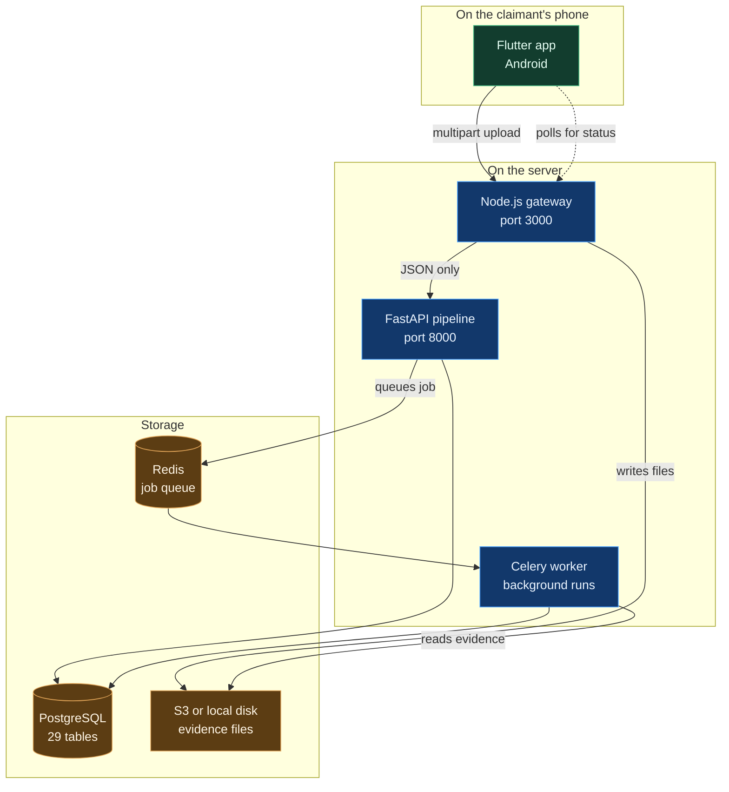
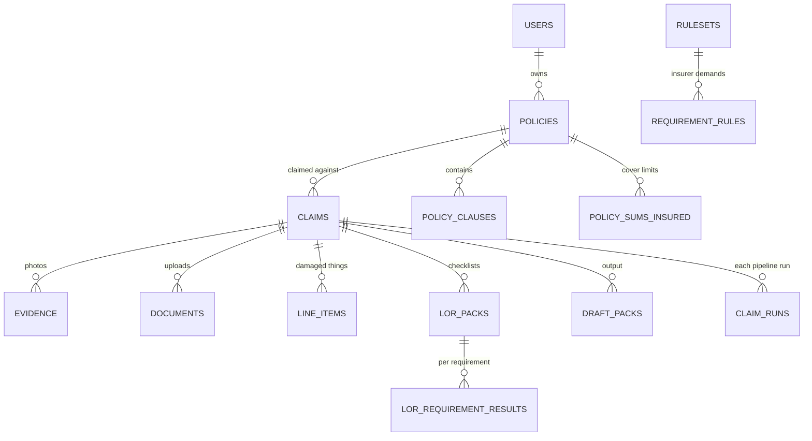

# Overview: how everything connects

This document follows one claim from a photo on a phone to a finished pack sitting with the insurer. If you read only one file in `docs/`, read this one.

---

## 1. The four moving parts

Each part has one job and does not do the others:

| Part | Does | Never does |
|---|---|---|
| Flutter app | Captures photos, collects form input, shows status | Talk to the AI pipeline directly |
| Node gateway | Receives files, hashes, encrypts, forwards JSON | Run AI, touch the database |
| FastAPI pipeline | Runs the AI graph, owns all business rules | Receive raw file uploads |
| Celery worker | Runs long pipelines in the background | Serve HTTP requests |

The gateway existing at all is a deliberate choice. File handling, deduplication and encryption are messy, and keeping them out of the Python service means the pipeline only ever deals with clean, validated JSON.

---

## 2. Following one claim

### Step 1: the app collects everything

The claimant photographs the damage. The app attaches the GPS position and the capture timestamp to each photo, because the pipeline later checks that the photo was taken near the insured address and within the loss window.

Before submitting, the app can call a **preview** endpoint with a single photo. This runs only the vision model and returns a proposed item list within seconds. The claimant confirms or edits it on screen. This matters: the claimant is reviewing a list, not writing one.

### Step 2: the gateway cleans it up

The app posts everything as one multipart request to `POST /api/commercial/submit` (or `/api/personal/submit`). The gateway then:

1. **Hashes every file** with SHA 256 and stores it at `uploads/<first two chars>/<full hash><extension>`. Upload the same file twice and it is stored once. This is called content addressing.
2. **Encrypts identity documents** using AES 256 GCM envelope encryption. A fresh key is generated per file, then that key is itself encrypted with a master key. The plaintext never touches disk.
3. **Catches file substitution.** If the same hash arrives as both the policy document and the ID, that is one file being reused for two roles, and the claim is blocked with a clear message.
4. **Builds a `ClaimState` JSON object** holding the policy, the event, evidence records, document records and any confirmed items.
5. **Forwards it** to the pipeline with the user's auth token attached.

The gateway keeps no state. Restart it mid claim and nothing is lost.

### Step 3: the pipeline decides

`POST /api/v1/claim/submit` writes the claim to PostgreSQL and immediately computes **revision 1 of the Letter of Requirement**, which is the checklist of documents this claim needs. That comes back in the same HTTP response, so the claimant sees their checklist right away instead of waiting for the full pipeline.

The heavy work is then queued to Redis and picked up by the Celery worker, which runs the 20 node LangGraph state machine described in [agentic_pipeline.md](agentic_pipeline.md).

### Step 4: the claimant fills the gaps

The checklist screen lists every missing document. Uploading one goes to `POST /api/claim/:claim_id/documents`, which attaches it and re runs the requirement check. When nothing blocking is left, the claim resumes.

This loop is the core user experience. The claimant is never guessing what the insurer wants.

### Step 5: the pack is produced

The pipeline writes a draft pack to the `draft_packs` table, a QC verdict to `qc_results`, and a hash receipt to `proof_receipts`. The app polls `GET /api/claim/:claim_id` and updates the screen as the status changes.

---

## 3. The one rule that shapes the whole system

> **The model observes. Python decides.**

Every AI call in this codebase returns a structured object describing what the model *saw*. No AI call returns a verdict.

Take document triage. The model looks at an upload and reports "this appears to be a restaurant menu, confidence 0.94." It does not report "reject this claim." A Python function called `_triage_verdict` takes that observation, compares the confidence against a configured threshold, checks the configured gate mode, and produces the verdict.

The same pattern repeats everywhere:

| The model says | Python decides |
|---|---|
| "This clause mentions electronics" | Whether the cited clause actually appears in the policy text |
| "I see a damaged laptop, quantity 2" | Whether 2 exceeds the quantity on the invoice |
| "This item is worth 45000" | Whether that breaches the sum insured ceiling |
| "This is a fire claim, confidence 0.6" | That 0.6 is too low to block, so widen the checklist instead |

The practical payoff is that every rule which can cost someone money is an ordinary Python function with a unit test. The test suite has 19 files covering exactly these gates.

---

## 4. Where data lives

PostgreSQL holds 29 tables. The ones worth knowing:

Three groups sit behind that:

* **Claim data.** `claims`, `evidence`, `documents`, `line_items` and the outputs `draft_packs`, `qc_results`, `reserve_estimates`, `proof_receipts`.
* **Insurer configuration.** `rulesets`, `requirement_rules` and `ruleset_claim_types`. These are versioned, so you can see exactly which requirement list a claim was judged against on any given date.
* **Audit.** `audit_log` records who did what. `llm_invocations` optionally records every model call with its prompt and response. `idempotency_keys` stops a retried submit from creating a duplicate claim.

Files never go in the database. Only their hash and a URI such as `fs://...` or `s3://...`.

---

## 5. Insurer rulesets and the Letter of Requirement

Each insurer has a master list of every document they might ever demand, across every kind of claim. It arrives as a PDF.

At onboarding, `ingest_requirements.py` reads that PDF once with an AI pass and produces reviewable JSON. A human checks it. That JSON is loaded into the database with `rulesets_cli` and activated on a date.

At claim time no AI ever reads the master document again. The pipeline narrows the list in two deterministic steps:

1. **By claim type.** A fire claim does not need burglary paperwork. Requirements with no claim type attached are universal and apply to everything.
2. **By condition.** Each requirement can carry an `applies_when` condition on category, item type or account type.

What survives is that claim's checklist. Requirements are either **blocking**, meaning the claim halts, or **advisory**, meaning it is listed but never stops anything.

There is a safety valve. If the claim type classifier is not confident (below 0.70, or the runner up is within 0.15), the system does not guess. It takes the union of the candidate sections and demotes everything non universal to advisory. A claimant is never blocked by a guess.

---

## 6. Configuration you will actually change

All of this lives in `agentic_pipeline/config.py` and is overridable by environment variable.

| Setting | Default | Meaning |
|---|---|---|
| `llm_provider` | `gemini` | Switch to `watsonx` for production |
| `auth_mode` | `firebase` | Or `demo` for local testing, `disabled` for anonymous |
| `ruleset_source` | `file` | Read requirements from JSON files or from the database |
| `doc_gate_mode` | `enforce` | Set `warn_only` if real claims start getting wrongly blocked |
| `lor_gate_mode` | `enforce` | Same idea for the document checklist |
| `s3_bucket` | empty | Set it to use S3 instead of local disk |
| `record_llm_invocations` | `false` | Turn on to keep a full AI audit trail |

Two of these are worth calling out. `doc_gate_mode` and `lor_gate_mode` let you soften the gates without touching code, which matters the first time real claims hit the system and you discover the thresholds were too aggressive.

---

## 7. What to read next

* [agentic_pipeline.md](agentic_pipeline.md) for every node and rule in the graph.
* [mobile_app.md](mobile_app.md) for the screens and the offline behaviour.
* [deployment.md](deployment.md) for getting it onto a real server.
